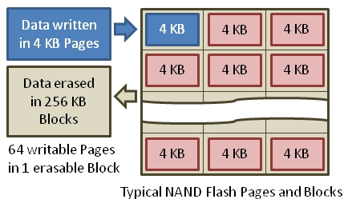

# 1 Trim原理

TRIM指令是微软联合各大SSD厂商所开发的一项技术，属于ATA8-ACS规范的技术指令。

TRIM是告诉NAND闪存固态存储设备要擦除哪些数据的SATA接口指令。当相关页面的数据可以被覆盖时，操作系统会发给SSD一个TRIM指令。SSD控制器等到主机开始删除和再次写入操作的时候，执行安全擦除操作。因为在写入操作过程中不用花时间去擦除原本的数据，写入速度要快得多。

Trim指令也叫disable delete notify(禁用删除通知)，当我们在操作系统中删除一个文件时，系统并没有真正删掉这个文件的数据，它只是把这些数据占用的地址标记为‘空’，即可以覆盖使用。但这只是在文件系统层面的操作，硬盘本身并不知道那些地址的数据已经‘无效’，除非系统通知它要在这些地址写入新的数据。

在HDD上本无任何问题，因为HDD允许覆盖写入，但到SSD上问题就来了，我们都已知道闪存不允许覆盖，只能先擦除再写入，要得到‘空闲’的闪存空间来进行写入，SSD就必须进行GC(垃圾回收)操作。在没有Trim的情况下，SSD无法事先知道那些被‘删除’的数据页已经是‘无效’的，必须到系统要求在相同的地方写入数据时才知道那些数据可以被擦除，这样就无法在最适当的时机做出最好的优化，既影响GC的效率(间接影响性能），又影响SSD的寿命。

而当Windows识别到SSD并确认SSD支持Trim后，在删除数据时，会不向硬盘通知删除指令，只使用Volume Bitmap来记住这里的数据已经删除。Volume Bitmap只是一个磁盘快照，其建立速度比直接读写硬盘去标记删除区域要快得多。这一步就已经省下一大笔时间了。然后再是写入数据的时候，由于NAND闪存保存数据是纯粹的数字形式，因此可以直接根据Volume Bitmap的情况，向快照中已删除的区块写入新的数据，而不用花时间去擦除原本的数据。如果SSD组RAID0后，将失去Trim功能。



SSD Read 和 Write 都以 page 为单位，而清除数据(Erase) 是以 block 为单位的。不过 SSD 的 Write 只能写到空的 page 上，不能像传统机械磁盘那样直接覆盖，修改数据时，操作流程为 read-modify-write：读取原有 page 的内容，在 cache 中修改，写入新的空的 page 中，修改逻辑地址到新的 page ，原有 page 标记为 ‘stale’，并没有清零。

Linux 文件系统对于删除操作，只标记为未使用，实际并没有清零，底层存储如 SSD 和传统机械磁盘并不知道哪些数据块可用，哪些数据块可以 Erase。所以对于非空的 page，SSD 在写入前必须先进行一次 Erase，则写入过程为 read-erase-modify-write: 将整个 block 的内容读取到 cache 中，整个 block 从 SSD 中 Erase, 要覆写的 page 写入到 cache 的 block 中，将 cache 中更新的 block 写入闪存介质，这个现象称之为写入放大( write amplification)。

为了解决这个问题，SSD 开始支持 TRIM，TRIM 功能使操作系统得以通知 SSD 哪些页不再包含有效的数据。TRIM 功能有助于延长 SSD 的长期性能和使用寿命。如果要启用 TRIM, 需要确认 SSD 、操作系统、文件系统都支持 TRIM。

根据 RedHat 的 SOLID-STATE DISK DEPLOYMENT GUIDELINES 介绍：随着所使用的 block 接近磁盘容量, SSD 的性能会开始降低，性能影响程度因供应商而异，但是所有设备都会遇到一些性能下降。为了解决性能退化问题，Linux 操作系统支持发送 discard 请求来通知存储器哪些 block 不再使用。

TRIM 功能使操作系统得以通知 SSD 哪些页不再包含有效的数据。TRIM 功能有助于延长 SSD 的长期性能和使用寿命。如果要启用 TRIM, 需要确认 SSD 、操作系统、文件系统都支持 TRIM。
固态硬盘（或固态硬盘），能够实现更快的读取和相比传统硬盘数据的写入速度。但是你可能不知道的是，随着时间的推移，当磁盘写满时，SSD可能会失去某些速度。如果出于速度考虑在服务器中运行SSD，请按照以下方法使用TRIM使SSD保持最佳状态。

为什么SSD会变慢？
首先让我们看看为什么会出现此问题。这与SSD的写入方式有关数据到存储。SSD将数据存储在固定大小的块（称为页面）中。然后将这些页面按称为块的较大组进行排列。尽管SSD可以单独读取和写入页面，但它们只能擦除数据块，而不能擦除单个页面。与可以覆盖数据块没有任何问题的硬盘驱动器不同，SSD需要先擦除块中的数据，然后才能将新数据写入内部页面。这在设计操作系统和文件系统时就成为问题，如果删除了文件，则将使用的文件块标记为可写入文件系统，但是这些块中的数据将保留到新数据为止。写在顶部。这是取消删除和文件恢复工具利用此原理从磁盘中恢复已删除文件的原理。

# 2 检测ssd是否支持

## 2.1 linux系统

方法1：
可以通过 /sys/block 下的信息来判断 SSD 支持 TRIM, discard_granularity 非 0 表示支持。
```bash
# cat /sys/block/sdm/queue/discard_granularity
512
```
也可以直接使用 lsblk 来检测，DISC-GRAN (discard granularity) 和 DISC-MAX (discard max bytes) 列非 0 表示该 SSD 支持 TRIM 功能。
```bash
# lsblk --discard
NAME                DISC-ALN DISC-GRAN DISC-MAX DISC-ZERO
sda                        0        0B       0B         0
├─sda1                     0        0B       0B         0
├─sda2                     0        0B       0B         0
├─sda3                     0        0B       0B         0
└─sda4                     0        0B       0B         0
sdb                        0      512B       4G         1
├─sdb1                     0      512B       4G         1
├─sdb2                     0      512B       4G         1
├─sdb3                     0      512B       4G         1
├─sdb4                     0      512B       4G         1
├─sdb5                     0      512B       4G         1
├─sdb6                     0      512B       4G         1
└─sdb7                     0      512B       4G         1
```
方法2：
```bash
# yum install hdparm -y
# hdparm -I  /dev/sdb | grep -i trim
           *    Data Set Management TRIM supported (limit 8 blocks)
           *    Deterministic read ZEROs after TRIM
```
## 2.2 windows系统

在CMD中查询
```bash
fsutil behavior query disabledeletenotify
```
如果你的电脑 `DisableDeleteNotify = 0`，则说明你的电脑系统已开启TRIM功能，如果`DisableDeleteNotify = 1`，则说明没开启。

# 3 启用 TRIM

TRIM是内置于ATA命令中的SSD命令，它是磁盘与计算机交互方式的一部分。操作系统能够将TRIM命令发送到磁盘，以使其知道哪些块是已删除文件的一部分，并允许SSD在需要写入之前先擦除这些块。虽然操作系统能够在每次驱动器删除文件系统上的文件时向驱动器发送信号以擦除这些部分，但这也会影响性能并减慢运行速度。因此，建议按计划运行TRIM以间歇性地清除块。

## 3.1 Linux系统

方法1：

修改/etc/fstab中的记录，加入discard选项。此方法弊端是降低磁盘的性能。
```bash
/dev/sdb1  /data       xfs   defaults,noatime,discard   0  0
```
方法2：

手动执行
```bash
# fstrim -a -v
```
> -a标志告诉fstrim检查所有可用的有效分区，-v标志提供详细的输出，向您显示fstrim已完成的操作。您应该看到命令的输出，以查看运行情况，如果输出为正，则可以将命令添加到crontab条目中。

方法3：

- 在 CentOS 7 中，已经自带了 `/usr/lib/systemd/system/fstrim.timer` 和 `/usr/lib/systemd/system/fstrim.service`
- 在 Ubuntu 中该服务默认是开启状态
```
/usr/lib/systemd/system/fstrim.timer：
[Unit]
Description=Discard unused blocks once a week
Documentation=man:fstrim

[Timer]
OnCalendar=weekly
AccuracySec=1h
Persistent=true

[Install]
WantedBy=multi-user.target
/usr/lib/systemd/system/fstrim.service：
[Unit]
Description=Discard unused blocks

[Service]
Type=oneshot
ExecStart=/usr/sbin/fstrim -a
```
只需开启即可：
```bash
# systemctl enable fstrim.timer
# systemctl start fstrim.timer
# systemctl status fstrim.timer
```
## 3.2 windows系统

开启：
```
fsutil behavior set disabledeletenotify 0
```
参考：
https://www.crucial.cn/articles/about-ssd/what-can-trim-do
https://zhuanlan.zhihu.com/p/34683444

转载：[SSD的TRIM原理及实践](https://blog.csdn.net/wylfengyujiancheng/article/details/120435464)