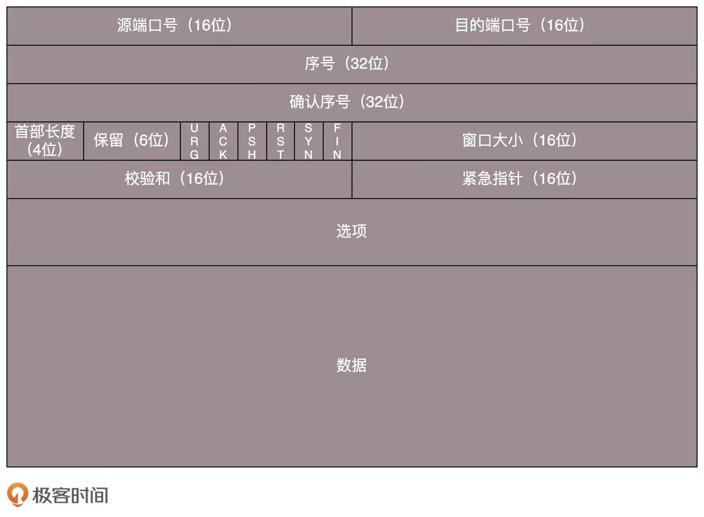

# 1 TCP（传输层）

（1）tcp面向字节流，有连接，有三次握手和四次断开，且支持双向数据传输（全双工）
（2）tcp有流量控制、滑动窗口、拥塞控制（慢开始，拥塞避免，快重传，快恢复。发送方维持一个拥塞窗口，大小取决于网络拥塞程度，发送窗口小于等于拥塞窗口）
（3）tcp有差错控制，超时重传和按序到达等机制

# 2 UDP（传输层）

（1）UDP在IP的基础上，面向报文，无连接，不保证可靠交付，只尽可能交付。
（2）因为udp报文中只有源端口、目的端口、udp长度和校验和、数据。
（3）发送数据之前无需建立连接，传输速度快，延迟低，开销小

# 3 IP（网络层）

