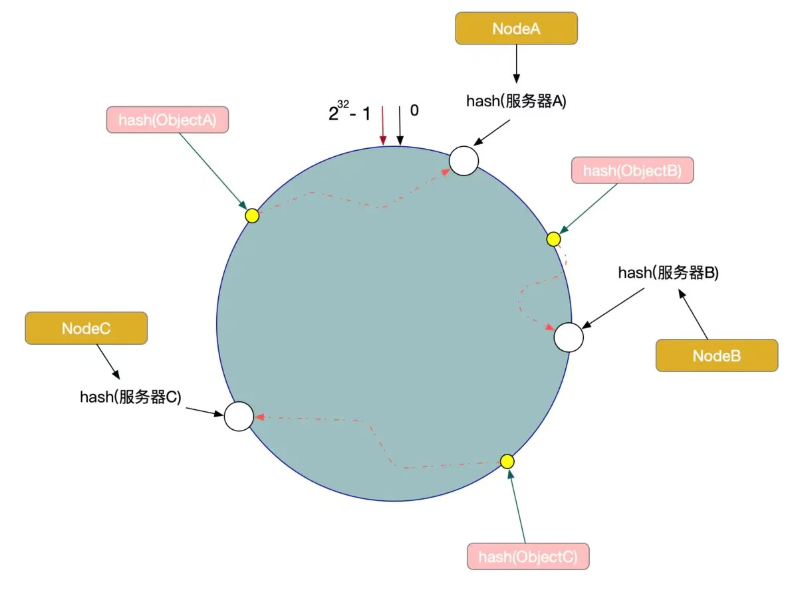
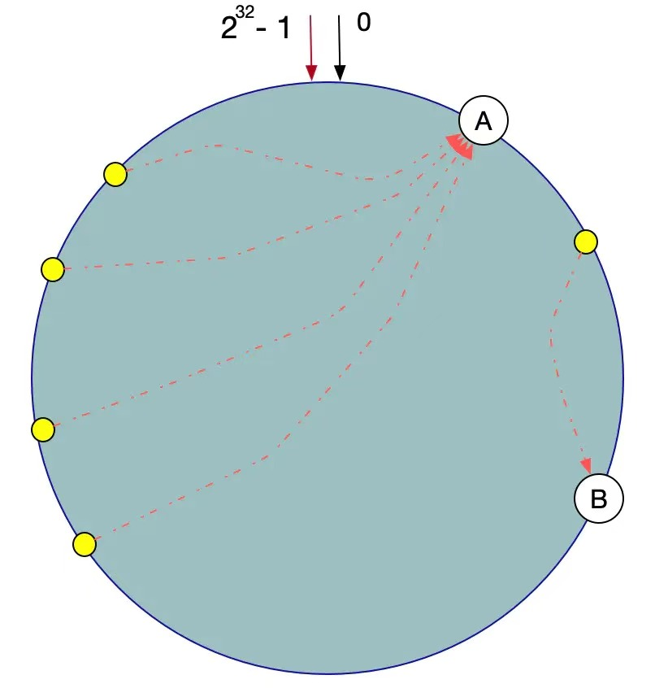

- [一致性Hash](#一致性hash)
  - [算法的容错性和可扩展性](#算法的容错性和可扩展性)
  - [数据倾斜问题](#数据倾斜问题)
  - [Hash冲突](#hash冲突)
- [Redis优化](#redis优化)
- [Redis 7.0](#redis-70)

# 一致性Hash

以Redis集群为例，集群中有三台节点，我们的数据以hash格式存储，当client访问某一个数据的时候，集群会随机调度一个集群节点响应client，这里就牵扯到一致性hash算法。

一致性hash会生成一个hash环，redis会把集群对象映射到此hash环中，Hash函数的值空间为0 ~ 2^32 - 1(一个32位无符号整型)，当有数据key请求过来，将数据Key使用相同的函数Hash计算出哈希值，并确定此数据在环上的位置，从此位置沿环顺时针查找，遇到的服务器就是其应该定位到的服务器。

## 算法的容错性和可扩展性
当有一个集群节点宕机了，但并不影响其他节点的使用。在一致性Hash算法中，如果一台服务器不可用，受影响的数据仅仅是此服务器到其环空间前一台服务器之间的数据（这里为Node C到Node B之间的数据），其他不会受到影响。

如果系统增加了一个节点，此节点的hash位置在NodeC和ObjectC中间位置，那么对于A和B节点并没有影响，影响的只是ObjectC。

一致性Hash算法对于节点的增减都只需重定位环空间中的一小部分数据，有很好的容错性和可扩展性。

## 数据倾斜问题
在一致性Hash算法服务节点太少的情况下，容易因为节点分布不均匀面造成数据倾斜（被缓存的对象大部分缓存在某一台服务器上）问题。

这时我们发现有大量数据集中在节点A上，而节点B只有少量数据。为了解决数据倾斜问题，一致性Hash算法引入了虚拟节点机制，即对每一个服务器节点计算多个哈希，每个计算结果位置都放置一个此服务节点，称为虚拟节点

数据定位算法不变，只需要增加一步：虚拟节点到实际点的映射。
所以加入虚拟节点之后，即使在服务节点很少的情况下，也能做到数据的均匀分布。

## Hash冲突
Redis hash表初始化多大（4 bucket） 静态表
多个key取模后的值落到redis的同一个bucket里，就是hash冲突

# Redis优化

1、尽量使用短的key
- 当然在精简的同时，不要为了key的“见名知意”。对于value有些也可精简，比如性别使用0、1。

2、避免使用keys *
- keys *, 这个命令是阻塞的，即操作执行期间，其它任何命令在你的实例中都无法执行。当redis中key数据量小时到无所谓，数据量大就很糟糕了。所以我们应该避免去使用这个命令。可以去使用SCAN,来代替。

3、在存到Redis之前先把你的数据压缩下
- redis为每种数据类型都提供了两种内部编码方式，在不同的情况下redis会自动调整合适的编码方式。

4、设置key有效期
- 我们应该尽可能的利用key有效期。比如一些临时数据（短信校验码），过了有效期Redis就会自动为你清除！

5、选择回收策略(maxmemory-policy)

6、尽可能的使用hash存储

7、限制redis内存大小
- 64位系统不限制内存，32位系统默认最多使用3GB内存

8、修改linux中TCP监听的最大容纳数量

9、修改linux内核内存分配策略
- redis在备份数据的时候，会fork出一个子进程，理论上child进程所占用的内存和parent是一样的，比如parent占用的内存为8G，这个时候也要同样分配8G的内存给child,如果内存无法负担，往往会造成redis服务器的down机或者IO负载过高，效率下降

10、关闭THE
- THP会造成内存锁影响redis性能，建议关闭

# Redis 7.0
- Cluster: 支持域名（之前仅支持ip）
- 将 AOF 作为多个文件存储在一个文件夹中
- 对 RDB 文件使用了新版本格式（10），与旧版本不兼容