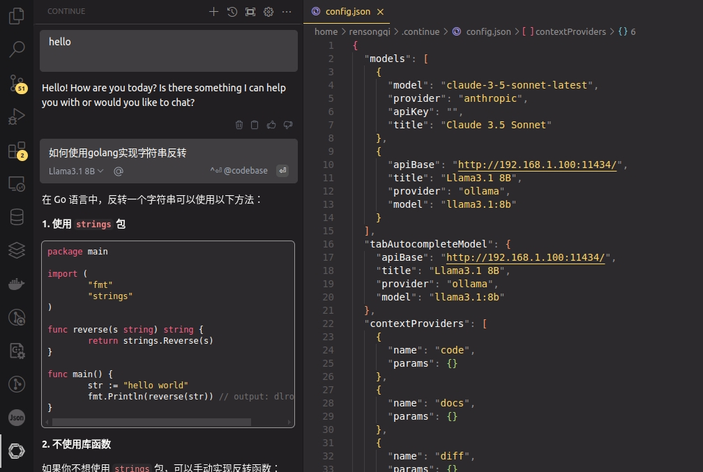

# 通过Ollama管理本地大模型


运行ollama

```bash
docker run -d -v ollama:/root/.ollama -p 11434:11434 --name ollama ollama/ollama
```

安装`llama3.1:8b`模型
```bash
docker exec -it ollama bash
ollama run llama3.1:8b
```

IDE安装`Continue`插件，修改模型为本地模型
```json
{
  "models": [
    {
      "model": "claude-3-5-sonnet-latest",
      "provider": "anthropic",
      "apiKey": "",
      "title": "Claude 3.5 Sonnet"
    },
    {
      "apiBase": "http://192.168.1.100:11434/",
      "title": "Llama3.1 8B",
      "provider": "ollama",
      "model": "llama3.1:8b"
    }
  ],
  "tabAutocompleteModel": {
    "apiBase": "http://192.168.1.100:11434/",
    "title": "Llama3.1 8B",
    "provider": "ollama",
    "model": "llama3.1:8b"
  },
  "contextProviders": [
    {
      "name": "code",
      "params": {}
    },
    {
      "name": "docs",
      "params": {}
    },
    {
      "name": "diff",
      "params": {}
    },
    {
      "name": "terminal",
      "params": {}
    },
    {
      "name": "problems",
      "params": {}
    },
    {
      "name": "folder",
      "params": {}
    },
    {
      "name": "codebase",
      "params": {}
    }
  ],
  "slashCommands": [
    {
      "name": "share",
      "description": "Export the current chat session to markdown"
    },
    {
      "name": "cmd",
      "description": "Generate a shell command"
    },
    {
      "name": "commit",
      "description": "Generate a git commit message"
    }
  ]
}
```

效果示例
