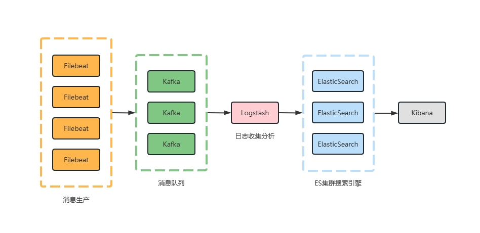

- [架构图](#架构图)
- [1 多节点部署ELK](#1-多节点部署elk)
  - [1.1 ES](#11-es)
  - [1.2 Kafka](#12-kafka)
  - [1.3 Logstash](#13-logstash)
  - [1.4 Filebeat](#14-filebeat)
- [2 单节点部署ES](#2-单节点部署es)

# 架构图



# 1 多节点部署ELK

## 1.1 ES

以三节点为例

```bash
mkdir /data/elk/elasticsearch/{config,data,plugins}
chmod -R 777 config data plugins

# vim /data/elk/config/elasticsearch.yml
# es-node1配置文件如下
cluster.name: material-es
node.name: es-node1
node.roles: [ master, data ]
xpack.security.enabled: false
network.host: 0.0.0.0
network.publish_host: 172.16.0.31
http.port: 9200
discovery.seed_hosts: ["172.16.0.31:9300", "172.16.0.32:9300", "172.16.0.33:9300"]
cluster.initial_master_nodes: ["es-node1","es-node2","es-node3"]
http.cors.enabled: true
http.cors.allow-origin: "*"

# es-node2配置文件如下
cluster.name: material-es
node.name: es-node2
node.roles: [ master, data ]
xpack.security.enabled: false
network.host: 0.0.0.0
network.publish_host: 172.16.0.32
http.port: 9200
discovery.seed_hosts: ["172.16.0.31:9300", "172.16.0.32:9300", "172.16.0.33:9300"]
cluster.initial_master_nodes: ["es-node1","es-node2","es-node3"]
http.cors.enabled: true
http.cors.allow-origin: "*"

# es-node3配置文件如下
cluster.name: material-es
node.name: es-node3
node.roles: [ master, data ]
xpack.security.enabled: false
network.host: 0.0.0.0
network.publish_host: 172.16.0.33
http.port: 9200
discovery.seed_hosts: ["172.16.0.31:9300", "172.16.0.32:9300", "172.16.0.33:9300"]
cluster.initial_master_nodes: ["es-node1","es-node2","es-node3"]
http.cors.enabled: true
http.cors.allow-origin: "*"
```

启动容器
docker-compose.yml
```yml
services:
  elasticsearch:
    image: elasticsearch:8.2.0
    restart: always
    ports:
      - "9200:9200"
      - "9300:9300"
    environment:
      ES_JAVA_OPTS: "-Xms5000m -Xmx5000m"
    volumes:
      - /data/elk/elasticsearch/config/elasticsearch.yml:/usr/share/elasticsearch/config/elasticsearch.yml
      - /data/elk/elasticsearch/certs:/usr/share/elasticsearch/certs
      - /disk01/elk/elasticsearch/data:/usr/share/elasticsearch/data
      - /disk01/elk/elasticsearch/plugins:/usr/share/elasticsearch/plugins
```
## 1.2 Kafka
docker-compose.yml
```yml
services:
  zookeeper:
    image: quay.io/strimzi/kafka:0.45.0-kafka-3.9.0
    command: [
        "sh", "-c",
        "bin/zookeeper-server-start.sh config/zookeeper.properties"
      ]
    ports:
      - "2181:2181"
    environment:
      LOG_DIR: /tmp/logs
  kafka:
    image: quay.io/strimzi/kafka:0.45.0-kafka-3.9.0
    command: [
      "sh", "-c",
      "bin/kafka-server-start.sh config/server.properties --override listeners=$${KAFKA_LISTENERS} --override advertised.listeners=$${KAFKA_ADVERTISED_LISTENERS} --override zookeeper.connect=$${KAFKA_ZOOKEEPER_CONNECT}"
    ]
    depends_on:
      - zookeeper
    ports:
      - "9092:9092"
    environment:
      LOG_DIR: "/tmp/logs"
      KAFKA_ADVERTISED_LISTENERS: PLAINTEXT://localhost:9092
      KAFKA_LISTENERS: PLAINTEXT://0.0.0.0:9092
      KAFKA_ZOOKEEPER_CONNECT: zookeeper:2181
```

## 1.3 Logstash
logstash.conf
```
input {
    kafka {
        topics_pattern => ".*"
        auto_offset_reset => "earliest"
        bootstrap_servers => ["kafka:9092"]
        group_id => "logstash"
        decorate_events => true
        codec => "json"
    }
}

filter {
    mutate {
        remove_field => ["[event][original]"]
    }
}

output {
    elasticsearch {
        hosts => ["172.16.0.31:9200", "172.16.0.32:9200", "172.16.0.33:9200"]
        index => "%{[@metadata][kafka][topic]}-%{+YYYY.MM.dd}"
    }
}
```

docker-compose.yml
```yml
services:
  logstash:
    image: logstash:8.4.2
    hostname: logstash
    container_name: logstash
    volumes:
      #- /elk/logstash/config/logstash.yml:/usr/share/logstash/config/logstash.yml:ro,Z
      - /data/elk/logstash/conf.d:/usr/share/logstash/pipeline:ro,Z
    ports:
      - "5044:5044"
      - "50000:50000/tcp"
      - "50000:50000/udp"
      - "9600:9600"
    environment:
      - LS_JAVA_OPTS=-Xms2048m -Xmx2048m
      - LOGSTASH_INTERNAL_PASSWORD=xxxxxx
      - TZ=Asia/Shanghai
    restart: always
    networks:
      - elk
```

## 1.4 Filebeat
若有需要可单独部署

docker-compose.yml
```yml
version: '3'
services:
  filebeat:
    image: filebeat:8.4.2
    user: root
    hostname: "${HOSTNAME}"
    command: filebeat -e -strict.perms=false
    volumes:
      - ./filebeat.docker.yml:/usr/share/filebeat/filebeat.yml:ro
      - /var/lib/docker/containers:/var/lib/docker/containers:ro
      - /var/run/docker.sock:/var/run/docker.sock:ro
      - ./system.yml:/usr/share/filebeat/modules.d/system.yml:ro
      - /var/log:/var/log:ro
    restart: always
```

filebeat.docker.yml

```yml
filebeat.config:
  modules:
    path: ${path.config}/modules.d/*.yml
    reload.enabled: true

filebeat.autodiscover:
  providers:
    - type: docker
      hints.enabled: true

processors:
- drop_event:
    when:
      contains:
        container.image.name: "filebeat:8.4.2"
- add_fields:
    fields:
      log_source: "server"

setup.kibana:
    host: "172.16.0.31:5601"

# ================================== Outputs ===================================
output.kafka:
  hosts: ["172.16.0.31:9092", "172.16.0.32:9092", "172.16.0.33:9092"]
  topic: '%{[fields.topic]}' # 根据topic自动创建对应的index
  topics:
    - topic: "system"
      when.contains:
        event.module: "system"
  partition.round_robin:
    reachable_only: false
  required_acks: 1
  compression: gzip
  max_message_bytes: 1000000
```

# 2 单节点部署ES
需要账号密码管理的es

`config/elasticsearch.yml`
```bash
cluster.name: material-es
node.name: es-node1
xpack.security.enabled: true
xpack.security.transport.ssl.enabled: true
network.host: 0.0.0.0
network.publish_host: 172.16.1.108
http.port: 9200
http.cors.enabled: true
http.cors.allow-origin: "*"
ingest.geoip.downloader.enabled: false
```

`config/kibana.yml`
```bash
i18n.locale: zh-CN
server.host: "0.0.0.0"
server.shutdownTimeout: "5s"
elasticsearch.hosts: [ "http://172.16.1.108:19200" ]
monitoring.ui.container.elasticsearch.enabled: true
elasticsearch.username: "elastic"
elasticsearch.password: "xxxxxxxx"
```

`docker-compose.yml`
```yml
version: '3.7'
services:
  elasticsearch:
    image: docker.io/elasticsearch:7.17.25
    container_name: fs-es
    environment:
      - discovery.type=single-node
      - ES_JAVA_OPTS=-Xms5000m -Xmx5000m
    ports:
      - "9200:9200"
      - "9300:9300"
    volumes:
      - /etc/localtime:/etc/localtime:ro
      - /etc/timezone:/etc/timezone:ro
      - ./config/elasticsearch.yml:/usr/share/elasticsearch/config/elasticsearch.yml
      - ./certs:/usr/share/elasticsearch/certs
      - /elk/fs-es:/usr/share/elasticsearch/data
    networks:
      - es-net

  kibana:
    image: docker.io/kibana:7.17.25
    hostname: kibana
    container_name: fs-kibana
    volumes: 
      - ./config/kibana.yml:/usr/share/kibana/config/kibana.yml
    ports:
      - "15601:5601"
    environment:
      - TZ=Asia/Shanghai
    restart: always
    networks:
      - es-net

networks:
  es-net:
    driver: bridge
```