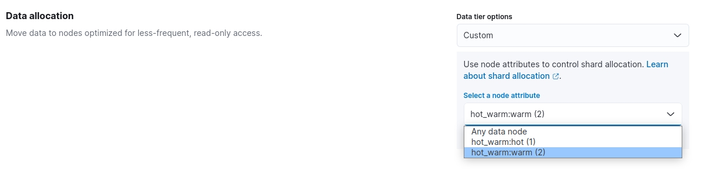

- [elasticsearch冷热数据分离](#elasticsearch冷热数据分离)
- [初始化](#初始化)
  - [172.16.1.247](#172161247)
  - [172.16.1.248](#172161248)
  - [172.16.1.249](#172161249)
  - [启动服务](#启动服务)
- [ES配置](#es配置)

# elasticsearch冷热数据分离

| IP | 角色 | 冷热 | 备注 |
| ---- | ---- | ---- | ---- | 
| 172.16.1.247 | master,data | hot  | es, zk, kafka, logstash, kibana
| 172.16.1.248 | master,data | warm | es, zk, kafka, logstash
| 172.16.1.249 | master,data | warm | es, zk, kafka, logstash 


# 初始化

三个节点均需要执行

```bash
mkdir -p /data/elk/logstash/conf.d
mkdir -p /data/elk/es/{config,data,plugins}
chmod 777 /data/elk/es/data
```

`/data/elk/logstash/conf.d/logstash.conf`
```
input {
    kafka {
        topics_pattern => ".*"
        auto_offset_reset => "earliest"
        bootstrap_servers => ["kafka:9092"]
        group_id => "logstash"
        decorate_events => true
        codec => "json"
    }
}

filter {
    mutate {
        remove_field => ["[event][original]"]
    }
}

output {
    elasticsearch {
        hosts => ["172.16.1.247:9200", "172.16.1.248:9200", "172.16.1.249:9200"]
        index => "%{[@metadata][kafka][topic]}-%{+YYYY.MM.dd}"
    }
}
```

## 172.16.1.247

`/data/elk/docker-compose.yml`
```yaml
version: '3.7'

services:
  elasticsearch:
    image: elasticsearch:8.4.2
    container_name: elasticsearch
    restart: always
    environment:
      - ES_JAVA_OPTS=-Xms8000m -Xmx8000m
    ports:
      - "9200:9200"
      - "9300:9300"
    volumes:
      - /data/elk/es/config/elasticsearch.yml:/usr/share/elasticsearch/config/elasticsearch.yml
      - /data/elk/es/data:/usr/share/elasticsearch/data
      - /data/elk/es/plugins:/usr/share/elasticsearch/plugins
    restart: always
    networks:
      - elk

  logstash:
    image: logstash:8.4.2
    hostname: logstash
    container_name: logstash
    volumes:
      - /data/elk/logstash/conf.d:/usr/share/logstash/pipeline:ro,Z
    ports:
      - "5044:5044"
      - "50000:50000/tcp"
      - "50000:50000/udp"
      - "9600:9600"
    environment:
      - LS_JAVA_OPTS=-Xms2048m -Xmx2048m
      - TZ=Asia/Shanghai
    restart: always
    networks:
      - elk

  kibana:
    image: kibana:8.4.2
    hostname: kibana
    container_name: kibana
    ports:
      - "5601:5601"
    environment:
      - SERVERNAME=kibana
      - ELASTICSEARCH_HOSTS=["http://172.16.1.247:9200"]
      - TZ=Asia/Shanghai
    restart: always
    networks:
      - elk
    
  zookeeper:
    image: zookeeper:3.8
    hostname: zookeeper
    container_name: zookeeper
    ports:
      - 2181:2181
      - 2888:2888
      - 3888:3888
    environment:
      - ZOO_SERVER_ID=1
      - ALLOW_ANONYMOUS_LOGIN=yes
      - ZOO_SERVERS=zookeeper:2888:3888,172.16.1.248:2888:3888,172.16.1.249:2888:3888
      - TZ=Asia/Shanghai
    restart: always
    networks:
      - elk

  kafka:
    image: kafka:3.2
    hostname: kafka
    container_name: kafka
    ports:
      - "9092:9092"
    environment:
      - KAFKA_CFG_ZOOKEEPER_CONNECT=zookeeper:2181
      - KAFKA_CFG_BROKER_ID=0
      - KAFKA_LOG_RETENTION_HOURS=6
      - ALLOW_PLAINTEXT_LISTENER=yes
      - KAFKA_CFG_LISTENER_SECURITY_PROTOCOL_MAP=EXTERNAL:PLAINTEXT
      - KAFKA_CFG_LISTENERS=EXTERNAL://0.0.0.0:9092
      - KAFKA_CFG_ADVERTISED_LISTENERS=EXTERNAL://172.16.1.247:9092
      - KAFKA_CFG_INTER_BROKER_LISTENER_NAME=EXTERNAL
      - TZ=Asia/Shanghai
    depends_on:
      - zookeeper
    restart: always
    networks:
      - elk

networks:
  elk:
    driver: bridge
```

`/data/elk/es/config/elasticsearch.yml`

```
cluster.name: material-es
node.name: es-hot-node1
node.roles: [ master, data ]
xpack.security.enabled: false
network.host: 0.0.0.0
network.publish_host: 172.16.1.247
http.port: 9200
discovery.seed_hosts: ["172.16.1.247:9300", "172.16.1.248:9300", "172.16.1.249:9300"]
cluster.initial_master_nodes: ["es-hot-node1","es-warm-node1","es-warm-node2"]
http.cors.enabled: true
http.cors.allow-origin: "*"
node.attr.hot_warm: hot
path.data: /usr/share/elasticsearch/data
ingest.geoip.downloader.enabled: false
```

## 172.16.1.248

`/data/elk/docker-compose.yml`

```yaml
version: '3.7'

services:
  elasticsearch:
    image: elasticsearch:8.4.2
    container_name: elasticsearch
    restart: always
    environment:
      - ES_JAVA_OPTS=-Xms8000m -Xmx8000m
    ports:
      - "9200:9200"
      - "9300:9300"
    volumes:
      - /data/elk/es/config/elasticsearch.yml:/usr/share/elasticsearch/config/elasticsearch.yml
      - /data/elk/es/data:/usr/share/elasticsearch/data
      - /data/elk/es/plugins:/usr/share/elasticsearch/plugins
    restart: always
    networks:
      - elk

  logstash:
    image: logstash:8.4.2
    hostname: logstash
    container_name: logstash
    volumes:
      - /data/elk/logstash/conf.d:/usr/share/logstash/pipeline:ro,Z
    ports:
      - "5044:5044"
      - "50000:50000/tcp"
      - "50000:50000/udp"
      - "9600:9600"
    environment:
      - LS_JAVA_OPTS=-Xms2048m -Xmx2048m
      - TZ=Asia/Shanghai
    restart: always
    networks:
      - elk
   
  zookeeper:
    image: zookeeper:3.8
    hostname: zookeeper
    container_name: zookeeper
    ports:
      - 2181:2181
      - 2888:2888
      - 3888:3888
    environment:
      - ZOO_SERVER_ID=2
      - ALLOW_ANONYMOUS_LOGIN=yes
      - ZOO_SERVERS=172.16.1.247:2888:3888,zookeeper:2888:3888,172.16.1.249:2888:3888
      - TZ=Asia/Shanghai
    restart: always
    networks:
      - elk

  kafka:
    image: kafka:3.2
    hostname: kafka
    container_name: kafka
    ports:
      - "9092:9092"
    environment:
      - KAFKA_CFG_ZOOKEEPER_CONNECT=zookeeper:2181
      - KAFKA_CFG_BROKER_ID=1
      - KAFKA_LOG_RETENTION_HOURS=6
      - ALLOW_PLAINTEXT_LISTENER=yes
      - KAFKA_CFG_LISTENER_SECURITY_PROTOCOL_MAP=EXTERNAL:PLAINTEXT
      - KAFKA_CFG_LISTENERS=EXTERNAL://0.0.0.0:9092
      - KAFKA_CFG_ADVERTISED_LISTENERS=EXTERNAL://172.16.1.248:9092
      - KAFKA_CFG_INTER_BROKER_LISTENER_NAME=EXTERNAL
      - TZ=Asia/Shanghai
    depends_on:
      - zookeeper
    restart: always
    networks:
      - elk

networks:
  elk:
    driver: bridge
```


`/data/elk/es/config/elasticsearch.yml`

```
cluster.name: material-es
node.name: es-warm-node1
node.roles: [ master,data ]
xpack.security.enabled: false
network.host: 0.0.0.0
network.publish_host: 172.16.1.248
http.port: 9200
discovery.seed_hosts: ["172.16.1.247:9300", "172.16.1.248:9300", "172.16.1.249:9300"]
cluster.initial_master_nodes: ["es-hot-node1","es-warm-node1","es-warm-node2"]
http.cors.enabled: true
http.cors.allow-origin: "*"
node.attr.hot_warm: warm
path.data: /usr/share/elasticsearch/data
ingest.geoip.downloader.enabled: false
```

## 172.16.1.249

`/data/elk/docker-compose.yml`

```bash
version: '3.7'

services:
  elasticsearch:
    image: elasticsearch:8.4.2
    container_name: elasticsearch
    restart: always
    environment:
      - ES_JAVA_OPTS=-Xms8000m -Xmx8000m
    ports:
      - "9200:9200"
      - "9300:9300"
    volumes:
      - /data/elk/es/config/elasticsearch.yml:/usr/share/elasticsearch/config/elasticsearch.yml
      - /data/elk/es/data:/usr/share/elasticsearch/data
      - /data/elk/es/plugins:/usr/share/elasticsearch/plugins
    restart: always
    networks:
      - elk

  logstash:
    image: logstash:8.4.2
    hostname: logstash
    container_name: logstash
    volumes:
      - /data/elk/logstash/conf.d:/usr/share/logstash/pipeline:ro,Z
    ports:
      - "5044:5044"
      - "50000:50000/tcp"
      - "50000:50000/udp"
      - "9600:9600"
    environment:
      - LS_JAVA_OPTS=-Xms2048m -Xmx2048m
      - TZ=Asia/Shanghai
    restart: always
    networks:
      - elk
   
  zookeeper:
    image: zookeeper:3.8
    hostname: zookeeper
    container_name: zookeeper
    ports:
      - 2181:2181
      - 2888:2888
      - 3888:3888
    environment:
      - ZOO_SERVER_ID=3
      - ALLOW_ANONYMOUS_LOGIN=yes
      - ZOO_SERVERS=172.16.1.247:2888:3888,172.16.1.248:2888:3888,zookeeper:2888:3888
      - TZ=Asia/Shanghai
    restart: always
    networks:
      - elk

  kafka:
    image: kafka:3.2
    hostname: kafka
    container_name: kafka
    ports:
      - "9092:9092"
    environment:
      - KAFKA_CFG_ZOOKEEPER_CONNECT=zookeeper:2181
      - KAFKA_CFG_BROKER_ID=2
      - KAFKA_LOG_RETENTION_HOURS=6
      - ALLOW_PLAINTEXT_LISTENER=yes
      - KAFKA_CFG_LISTENER_SECURITY_PROTOCOL_MAP=EXTERNAL:PLAINTEXT
      - KAFKA_CFG_LISTENERS=EXTERNAL://0.0.0.0:9092
      - KAFKA_CFG_ADVERTISED_LISTENERS=EXTERNAL://172.16.1.249:9092
      - KAFKA_CFG_INTER_BROKER_LISTENER_NAME=EXTERNAL
      - TZ=Asia/Shanghai
    depends_on:
      - zookeeper
    restart: always
    networks:
      - elk

networks:
  elk:
    driver: bridge
```


`/data/elk/es/config/elasticsearch.yml`

```
cluster.name: material-es
node.name: es-warm-node2
node.roles: [ master,data ]
xpack.security.enabled: false
network.host: 0.0.0.0
network.publish_host: 172.16.1.249
http.port: 9200
discovery.seed_hosts: ["172.16.1.247:9300", "172.16.1.248:9300", "172.16.1.249:9300"]
cluster.initial_master_nodes: ["es-hot-node1","es-warm-node1","es-warm-node2"]
http.cors.enabled: true
http.cors.allow-origin: "*"
node.attr.hot_warm: warm
path.data: /usr/share/elasticsearch/data
ingest.geoip.downloader.enabled: false
```

## 启动服务

```bash
docker-compose up -d elasticsearch
docker-compose up -d kafka
docker-compose up -d logstash
```

# ES配置

获取节点属性信息

`GET _cat/nodeattrs?v&h=node,attr,value&s=attr:desc`
```
node          attr            value
es-warm-node1 xpack.installed true
es-warm-node2 xpack.installed true
es-hot-node1  xpack.installed true
es-warm-node1 hot_warm        warm
es-warm-node2 hot_warm        warm
es-hot-node1  hot_warm        hot
```

集群通过`hot_warm`属性来制定`allocation.awareness`的规则

- [官方文档](https://www.elastic.co/guide/en/elasticsearch/reference/8.17/modules-cluster.html#cluster-routing-settings)

`PUT _cluster/settings`
```
{
  "persistent": {
    "cluster.routing.allocation.awareness.attributes": "hot_warm",
    "cluster.routing.allocation.include.hot_warm": "hot"
  }
}
```

设置`index template`，使得创建的索引默认都可以被分配在hot节点

```
{
  "index": {
    "lifecycle": {
      "name": "log_policy"
    },
    "routing": {
      "allocation": {
        "include": {
          "hot_warm": "hot"
        }
      }
    },
    "number_of_shards": "3",
    "number_of_replicas": "0"
  }
}
```

使用API给index配置lifecycle（支持批量操作）
```
PUT my_index-*/_settings
{
  "index": {
    "lifecycle": {
      "name": "log_policy"
    }
  }
}
```

解释为什么某个分片不能分配给某个节点
```
GET _cluster/allocation/explain


GET _cluster/allocation/explain
{
  "index": "syslog-net-2025.03.25",
  "shard": 0,
  "primary": false
}
```

配置index lifecycle policy


- 创建 log_policy
- Hot phase 需要 disable rollover
- Warm phase 选择指定时间，配置Data allocation，选择Custom --> `hot_warm:warm`如下图所示



创建index并写入数据测试，会发现数据都分布到es-hot-node1节点中

`GET /_cat/shards/rensongqi-syslog-2025.02.18?v&h=index,shard,prirep,state,docs,store,ip,node`
```
index                       shard prirep state   docs   store ip           node
rensongqi-syslog-2025.02.18 0     p      STARTED  320      0b 172.16.1.247 es-hot-node1
rensongqi-syslog-2025.02.18 1     p      STARTED  281      0b 172.16.1.247 es-hot-node1
rensongqi-syslog-2025.02.18 2     p      STARTED  299 832.2kb 172.16.1.247 es-hot-node1
```