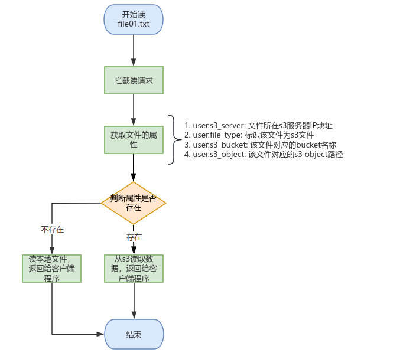
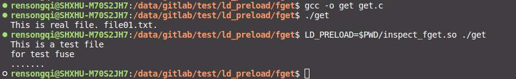
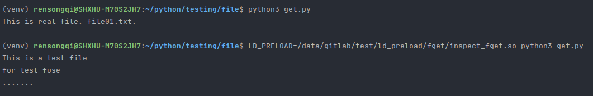
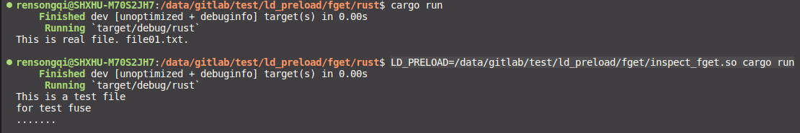

# 基于LD_PRELOAD的读文件拦截
- [基于LD\_PRELOAD的读文件拦截](#基于ld_preload的读文件拦截)
- [1 前言](#1-前言)
- [2 实现架构](#2-实现架构)
- [3 安装依赖](#3-安装依赖)
- [4 测试方法](#4-测试方法)
  - [4.1 C](#41-c)
  - [4.2 Python](#42-python)
  - [4.3 Rust](#43-rust)
  - [4.4 Go](#44-go)

# 1 前言

基于LD_PRELOAD实现在用户态拦截应用程序的读请求，从文件的属性中获取该文件所在目标s3等位置信息，从s3获取数据信息，并返回给客户端程序

参考文章: [使用LD_PRELOAD注入程序](https://www.cnblogs.com/sandeepin/p/ld-preload-inject.html)

# 2 实现架构



# 3 安装依赖

以ubuntu为例

```bash
# 安装libcurl
apt-get install curl
apt-get install libcurl4-gnutls-dev
sudo ln -s  /usr/include/x86_64-linux-gnu/curl  /usr/include/curl
sudo ln -s  /usr/include/x86_64-linux-gnu/curl  /usr/include/curl/curl

# 安装libxml2
apt-get install libxml2
apt-get install libxml2-dev

# 克隆libs3
git clone https://github.com/bji/libs3.git

# 编译
cd libs3
make && make install

# 编译s3_get_object.c ，此步骤仅测试，可不用操作
gcc -o s3_get_object s3_get_object.c -ls3 -lcurl

# 编译inspect_fget.so
gcc -shared -fPIC inspect_fget.c -o inspect_fget.so -ldl -ls3 -lcurl
```

# 4 测试方法
1. 创建测试文件

```bash
echo "This is real file. file01.txt." >> file01.txt
```

2. 给文件设置属性
- GPFS文件系统上设置的属性可以永久生效，属性存在inode中
- 其它普通文件系统如xfs、ext等文件系统的文件设置完属性后`一旦文件被修改`则属性也随之消失

```bash
# 设置属性
#              key前缀必须带user.          属性值        文件名
setfattr --name user.s3_object --value s3_file01.txt file01.txt
setfattr --name user.s3_bucket --value devops file01.txt

# 获取属性
getfattr -d file01.txt

# 删除属性
setfattr --remove user.s3_object file01.txt
```

## 4.1 C
> inspect_fget.so 实现了`fgets()`，也可实现`fread()`和`fscanf()`

测试代码`get.c`
```c
#include <stdio.h>
#include <stdlib.h>

int main() {
    FILE *file;
    char buffer[256];
    const char *filename = "file01.txt";

    file = fopen(filename, "r");
    if (file == NULL) {
        perror("open file failed.");
        return 1;
    }

    while (fgets(buffer, sizeof(buffer), file) != NULL) {
        printf("%s", buffer);
    }

    fclose(file);

    return 0;
}
```
编译测试
```bash
# 编译
gcc -o get get.c

# 读本地文件
./get

# 配置LD_PRELOAD读
LD_PRELOAD=inspect_fget.so ./get
```



## 4.2 Python
>inspect_fget.so 实现了`read()`

测试代码`get.py`
```python
with open('file01.txt', 'r') as file:
    content = file.read()

print(content)
```
测试
```bash
# 读本地文件
python3 get.py

# 配置LD_PRELOAD读
LD_PRELOAD=inspect_fget.so python3 get.py
```



## 4.3 Rust
>inspect_fget.so 实现了`read()`

测试代码`main.rs`
```rs
use std::fs::File;
use std::io::{self, BufReader, Read};

fn main() -> io::Result<()> {
    let file = File::open("file01.txt")?;
    let mut reader = BufReader::new(file);
    let mut content = String::new();
    reader.read_to_string(&mut content)?;
    println!("{}", content);
    Ok(())
}
```
测试
```bash
# 新建项目
cargo new rust

# 读文件
cargo run

# 配置LD_PRELOAD读
LD_PRELOAD=inspect_fget.so cargo run
```


## 4.4 Go

待测试，需要开启cgo