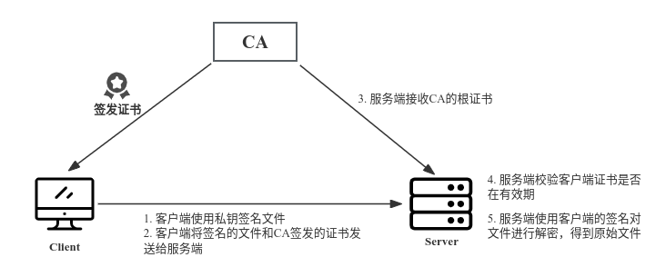

## 1 SSH 登录
基于SSH CA进行ssh远程登录校验流程图：


### 1.1 创建CA
生成CA的key和自签证书
```bash
# 1. 生成CA的key
mkdir ~/openssl && cd ~/openssl
(umask 077; openssl genrsa -out ca.key 2048)

# 2. CA自签证书
openssl req -new -x509 -key ca.key -days 7300 -out ca.crt

# 3. 从ca.key文件中SSH PKC8私钥
openssl pkcs8 -topk8 -inform PEM -in ca.key -nocrypt -out ca_ssh.key

# 4. 从ca_ssh.key私钥文件中提取出公钥
ssh-keygen -y -f ca_ssh.key > ca_ssh.pub
```

### 1.2 配置SSH服务端
ssh服务端需要授信CA的公钥文件，把CA的公钥文件ca_ssh.pub拷贝到服务端，然后修改sshd的配置文件

```bash
# 1. 修改sshd的配置文件
vim /etc/ssh/sshd_config
TrustedUserCAKeys /etc/pki/CA/certs/ca_ssh.pub

# 2. 检测sshd配置文件语法是否正确
sshd -t

# 3. restart sshd
systemctl restart sshd
```

### 1.3 客户端生成证书请求
```bash
# 1. 客户端生成key文件
mkdir ~/openssl && cd mkdir ~/openssl
(umask 077; openssl genrsa -out client.key 2048)

# 2. 客户端生成证书签名请求
openssl req -new -key client.key -days 3650 -out client.csr

# 3. 把client.csr发送给CA，进行签名
...
```

### 1.4 CA给客户端签发证书
CA给客户端签发证书，该证书是由CA签发生成的公钥
```bash
# 1. 将client.csr 放在~/openssl/client目录下
mkdir ~/openssl/client && cd ~/openssl/client

# 2. 签发客户端证书
openssl ca -in client.csr -out client.crt -cert ../ca.crt -keyfile ../ca.key

# 3. 从客户端的证书中提取出公钥文件
openssl x509 -in client.crt -pubkey -noout > client.pub

# 4. 将客户端公钥文件转为openssh格式
ssh-keygen -f client.pub -i -m PKCS8 > client_ssh.pub

# 5. CA使用从ca.key文件中提取出来的ca_ssh.key私钥文件对client_ssh.pub进行公钥签发
cd ~/openssl
ssh-keygen \
  -s ./ca_ssh.key \
  -I rensongqi \
  -n root,guest \
  -V +24h \
  client/client_ssh.pub
# 执行完命令会输出如下信息
# Signed user key client/client_ssh-cert.pub: id "rensongqi" serial 0 for root valid from 2023-12-13T14:37:00 to 2023-12-14T14:38:52

# 6. 将CA签发的公钥证书client.crt及ssh的公钥文件client_ssh-cert.pub返回给客户端
# 文件在 ~/openssl/client/client_ssh-cert.pub
```

ssh-keygen签发证书参数解析：
- -s ./ca_ssh.key - 指定CA签名的私钥 。
- -I rensongqi - 客户证书的密钥标识信息，可写写客户端的主机名。
- -n root,guest - 客户端可用于登录主机的用户名（多个用户以逗号分隔）。
- -V +24h - 证书有效期，从现在起24个小时（可选）。
- client/client_ssh.pub - 客户端的公钥。

### 1.5 客户端SSH访问服务端

从CA返回的证书需要跟客户端的私钥存放在同一级目录

```bash
# 1. 进入客户端key所在的目录
cd ~/openssl

# 2. 把从CA端接收的签发公钥文件命名前缀要跟key文件保持一致，最终的目录结构如下
.
├── client.csr
├── client.key
└── client.key-cert.pub # CA签发的公钥文件，前缀一定要跟key保持一致，否则不能免密登录


# 2. 指定私钥远程到目标服务器
[root@localhost openssl]# ssh -i ./client.key root@172.16.100.151
Last login: Wed Dec 13 14:51:32 2023 from test.rsq.cn
[root@SHJDS-OSSTEST ~]# 

# 查看客户端的公钥信息
[root@localhost openssl]# ssh-keygen -L -f client.key-cert.pub
client.key-cert.pub:
        Type: ssh-rsa-cert-v01@openssh.com user certificate
        Public key: RSA-CERT SHA256:MNVDGNGwAGpFrFhRZNA65SR38TS6029igd3SpaS5VNQ
        Signing CA: RSA SHA256:UyypRoY992V9UoStLAZm3cjoaSFRRuSXgVlmQGDrXoo
        Key ID: "rensongqi"
        Serial: 0
        Valid: from 2023-12-13T14:49:00 to 2023-12-14T14:50:24
        Principals: 
                root
                guest
        Critical Options: (none)
        Extensions: 
                permit-X11-forwarding
                permit-agent-forwarding
                permit-port-forwarding
                permit-pty
                permit-user-rc
```

## 2 包签名与离线验签
### 2.1 包签名



PS：上图中的操作都在客户端进行模拟测试：

客户端使用自己的私钥client.key对文件进行加密，然后使用签发的证书中提取出来的公钥进行解密

```bash
# 1. 提取CA签发的客户端证书中的公钥
cd ~/openssl
openssl x509 -in client.crt -pubkey -noout > client.pub

# 2. 客户端使用私钥加密文件，生成加密的文件 test-A.desc
openssl rsautl -sign -inkey client.key -in test-A.txt -out test-A.desc

# 3. 客户端使用client.pub对文件进行解密，输出新文件 test-B.txt
openssl rsautl -verify -pubin -inkey client.pub -in test-A.desc -out test-B.txt

# 目录结构
.
├── client.crt   # CA签发的证书
├── client.csr   # 客户端生成的证书请求文件
├── client.key   # 客户端key私钥文件
├── client.key-cert.pub   # CA签发的SSH公钥文件
├── client.pub   # 使用openssl x509从crt中提取出来的公钥文件
├── test-A.desc  # 加密文件
├── test-A.txt   # 原始文件
└── test-B.txt   # 解密文件
```

### 2.2 离线验签

ssh服务端需要实现预埋CA的根证书ca.crt

```bash
# CA - 验证客户端证书的有效性
openssl verify -CAfile ca.crt client.crt
client.crt: OK

# 使用client.pub对文件进行解密，输出新文件 test-B.txt
openssl rsautl -verify -pubin -inkey client.pub -in test-A.desc -out test-B.txt
```
