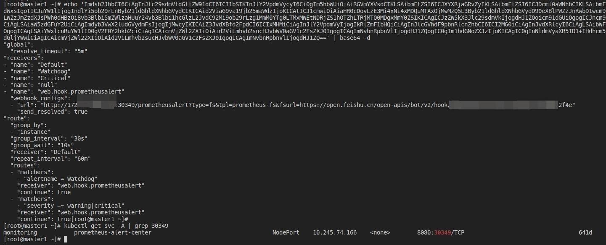

# 基于Prometheus的监控流程

目前市面上有很多exporter（包括node-exporter、dcgm_exporter、infiniband_exporter、mysql_exporter、等等），这些exporter一般都是跟服务或服务器本身关联的，跟服务相关的比如mysql服务有mysql自己的exporter，elasticsearch服务有elasticsearch自己的exporter；跟服务器相关的主要就是node-exporter。这些exporter都只干一件事，就是每隔一段时间采集服务或服务器的一些指标数据，通过http的形式呈现，所有的exporter都可以通过网页看到他们获取的指标数据，如下图所示：

后续通常都使用prometheus采集exporter的数据，prometheus（只是数据源的一种）会把这些exporter各种指标数据采集并存放到自己的数据库中（数据有保留的时间上限，到期会被自动清理，保证数据正向发展，不至于磁盘空间爆满），然后grafana基于prometheus或其它数据源（称为Data Source）读取解析采集后的数据绘制成图表。

每个图表都可以配置自己的告警策略，比如磁盘空间水位到哪个值、cpu到哪个值会触发告警等，告警这块都有现成的模板可以拿来即用，需要自己改的比较少，一般可在不同exporter对应的github仓库中找到相对应的关键告警指标模板，下图是手动配置告警，一般不这么干，比较麻烦，了解即可

然后就是告警模板，模板一般是通过prometheusAlert插件定义和管理的，Github仓库地址：[prometheusAlert](https://github.com/feiyu563/PrometheusAlert)，可以参考该仓库的README，可以通过Alertmanager或grafana关联prometheusAlert。

以Alertmanager组件为例，其是prometheus中的一个原生组件，所有告警都会先到这个组件，配置webhook地址为prometheusAlert（这个组件不是官方提供的组件，属于民间人员开发管理的），[Alertmanager关联prometheusAlert](https://github.com/feiyu563/PrometheusAlert/blob/master/doc/readme/system-prometheus.md)。

静默告警的时候都会访问Alertmanager这个地址。这样关联起来之后就形成了告警的数据闭环，从数据采集，到数据展示，再到告警通知。

