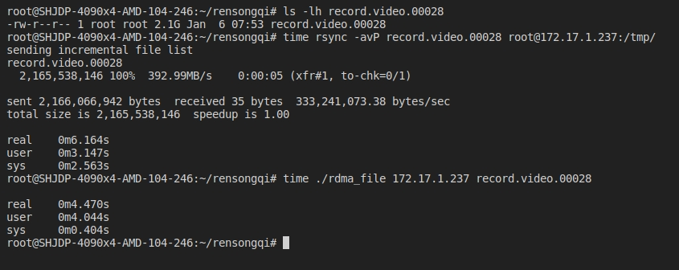
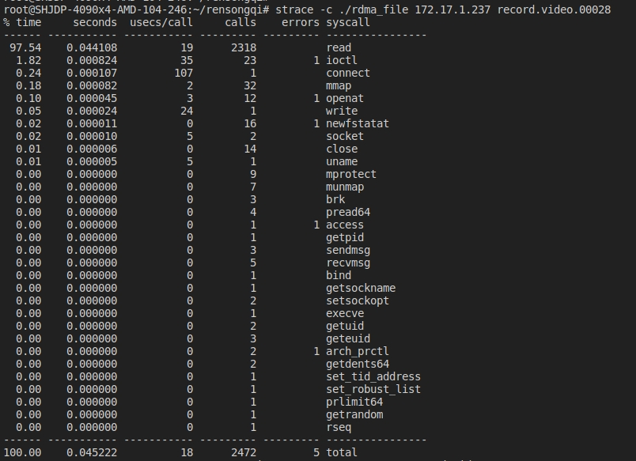
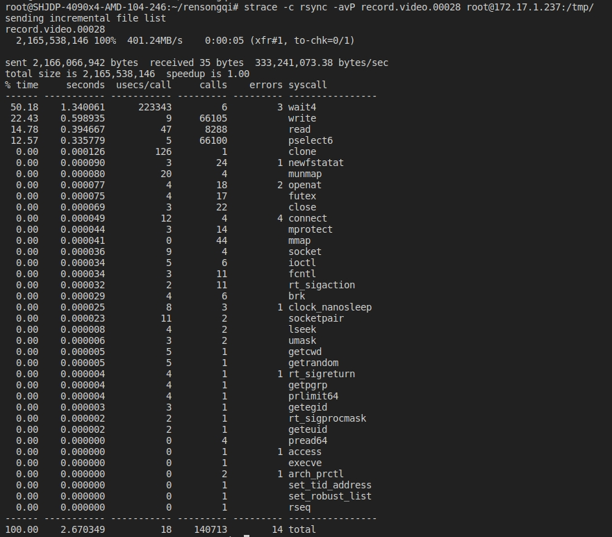
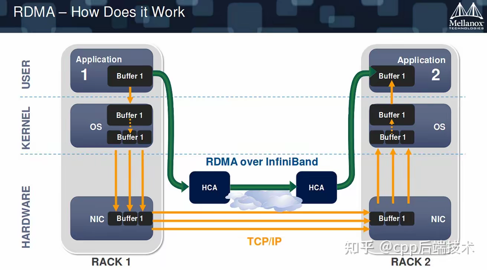

# Test rdma


## Getting started

Installation dependency

```bash
sudo apt-get update
sudo apt-get install -y libibverbs-dev librdmacm-dev perftest rdma-core
```

Test

`rdma.c`
```bash
# 修改run_server()和run_client()方法中 local_info.lid 为正确的lid值

# build
gcc -o rdma  rdma.c  -libverbs -o rdma

# server 172.17.1.237
./rdma

# client 172.17.1.246
./rdma 172.17.1.237
```

`rdma_copy_file.c`

```bash
# 修改run_server()和run_client()方法中 local_info.lid 为正确的lid值

# build
gcc -o rdma_file file.c -libverbs -o rdma_file

# server
./rdma_file

# client
./rdma_file 172.17.1.237 record.video.00028

# 测试拷贝时间
# 本地文件走TCP/IP协议
time rsync -avP record.video.00028 root@172.17.1.237:/tmp/

# 使用rdma协议
time ./rdma_file 172.17.1.237 record.video.00028

```

测试效果，对于一个2GB的大文件，可以发现走rdma协议比走TCP协议快了接近2s。



同时也可以发现，走rdma协议基本没有消耗sys的时间，消耗的一点sys时间基本为read文件的时间，通过strace可以跟踪程序执行期间调用的系统调用，分析哪些内核操作消耗了时间。





注意 `#define MSG_SIZE    1024` MSG_SIZE的大小是决定文件拷贝性能的因素

## CMD

```bash
# 查看ib状态
ibstat

# 查看ib连接信息
iblinkinfio

# 查看ib卡详细信息
ibv_devinfo
ibv_devices

# 延迟测试
# server
ibping -S

# client
ibping <server lid port>

```

## 工作原理



**传统**
- 可以看到传统的方法需要经过用户态->内核->硬件。
- 传统的TCP/IP模式数据需要由用户态->内核态->网卡->对端机器，数据会经过封装和解封装。需要CPU参与的次数很多，


**RDMA**
- RDMA直接是只经过用户态，数据的存取是通过RDMA硬件（万兆/IB网卡）直接操作内存的，不需要CPU的参与，无需经过内核态和数据封装解封装的过程。

**优势**
1. 零拷贝(Zero-copy)： 应用程序能够直接执行数据传输，在不涉及到网络软件栈的情况下。数据能够被直接发送到缓冲区或者能够直接从缓冲区里接收，而不需要被复制到网络层。
2. 内核旁路(Kernel bypass) - 应用程序可以直接在用户态执行数据传输，不需要在内核态与用户态之间做上下文切换。
3. 不需要CPU干预(No CPU involvement) - 应用程序可以访问远程主机内存而不消耗远程主机中的任何CPU。远程主机内存能够被读取而不需要远程主机上的进程（或CPU)参与。远程主机的CPU的缓存(cache)不会被访问的内存内容所填充。
4. 消息基于事务(Message based transactions) - 数据被处理为离散消息而不是流，消除了应用程序将流切割为不同消息/事务的需求。
5. 支持分散/聚合条目(Scatter/gather entries support) - RDMA原生态支持分散/聚合。也就是说，读取多个内存缓冲区然后作为一个流发出去或者接收一个流然后写入到多个内存缓冲区里去。

**工作流程**
1. 初始化context，注册内存域
2. 建立RDMA连接
3. 通过SEND/RECEIVE操作，C/S交换包含RDMA memory region key的MSG_MR消息（一般是客户端先发送）
4. 通过WRITE/READ操作，进行数据传输（单边操作）
5. 发送MSG_DONE消息，关闭连接


**参考文章**
- [RDMA(远程直接内存访问)原理架构图文详解+与传统通信模式对比](https://zhuanlan.zhihu.com/p/701779103)
- [GPU 主机如何开启 GDS](https://www.chenshaowen.com/blog/how-to-enable-gds-on-gpu-host.html)