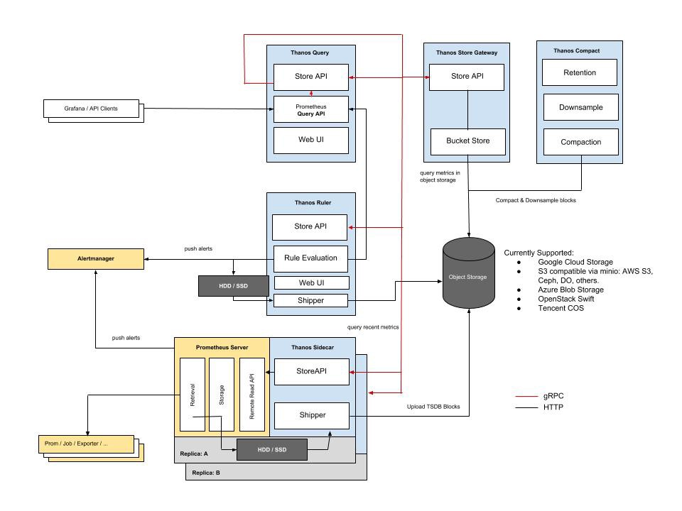

- [架构说明](#架构说明)
- [部署方式](#部署方式)
  - [Docker部署](#docker部署)
  - [Kubernetes部署](#kubernetes部署)
- [接入Prometheus](#接入prometheus)
- [Thanos增加配置](#thanos增加配置)

# 架构说明
Thanos架构图：


组件的功能分别是：
- Sidecar： Thanos 的数据上传组件，用来和 Prometheus 通信，并且将 Prometheus 的监控数据上传到对象存储
- Query：Thanos 的查询组件，用来查询监控数据
- Store：Thanos 的数据存储组件，用来和对象存储通信，为对象存储提供数据代理服务。
- Receive：Thanos 的数据收取组件，支持 Prometheus 的远程写功能，对于同一个 Prometheus 实例，只能在 Sidecar 和 Receiver 中间二选一。
- Rule：Thanos 的集中的告警管理组件
- Compactor：Thanos 的数据处理组件，用来将监控数据降准和压缩
- Query Frontend：Thanos 的查询前端
- tools：Thanos 的运维工具，用途很多。

# 部署方式
## Docker部署
docker-compose.yml
```yaml
version: '2.1'
services:
  # Node Exporter
  node-exporter:
    image: docker.io/bitnami/node-exporter:1
    ports:
      - '9100:9100'
    command:
      - --web.listen-address=0.0.0.0:9100
  # Prepare Prometheus Configuration
  prepare-prometheus:
    image: docker.io/bitnami/minideb:latest
    command:
      - /bin/bash
      - -ec
      - |
        cat >'/conf/prometheus.yml'<<'EOF'
        global:
          scrape_interval: 5s
          external_labels:
            foo: bar
        scrape_configs:
          - job_name: node-exporter
            static_configs:
              - targets:
                  - node-exporter:9100
          - job_name: prometheus
            static_configs:
              - targets:
                  - localhost:9090
        EOF
    volumes:
      - 'prom_conf:/conf'
  # Prometheus Server
  prometheus:
    image: docker.io/bitnami/prometheus:2
    ports:
      - '9091:9090'
    volumes:
      - 'tsdb_data:/opt/bitnami/prometheus/data'
      - 'prom_conf:/opt/bitnami/prometheus/conf'
    depends_on:
      - node-exporter
      - prepare-prometheus
  # Thanos Sidecar
  sidecar:
    image: docker.io/bitnami/thanos:0
    command:
      - sidecar
      - --tsdb.path=/data
      - --prometheus.url=http://prometheus:9090
      - --grpc-address=0.0.0.0:10901
    volumes:
      - 'tsdb_data:/data'
    depends_on:
      - query
  # MinIO
  minio:
    image: docker.io/bitnami/minio:2021
    ports:
      - '9000:9000'
      - '9001:9001'
    healthcheck:
      test: ["CMD", "curl", "-f", "http://localhost:9000/minio/health/live"]
      interval: 30s
      timeout: 10s
      retries: 5
    volumes:
      - 'minio_data:/data'
    environment:
      - MINIO_ROOT_USER=minio
      - MINIO_ROOT_PASSWORD=minio123
      - MINIO_DEFAULT_BUCKETS=thanos
  # Prepare Object Store configuration
  prepare-object-store-conf:
    image: docker.io/bitnami/minideb:latest
    command:
      - /bin/bash
      - -ec
      - |
        cat >'/conf/bucket.yml'<<'EOF'
        type: s3
        config:
          bucket: thanos
          endpoint: minio:9000
          insecure: true
          access_key: minio
          secret_key: minio123
        EOF
    volumes:
      - 'ojb_store_conf:/conf'
  # Thanos Store Gateway
  store-gateway:
    image: docker.io/bitnami/thanos:0
    command:
      - store
      - --objstore.config-file=/conf/bucket.yml
      - --data-dir=/data
      - --grpc-address=0.0.0.0:10901
    user: "0"
    volumes:
      - 'ojb_store_conf:/conf'
      - 'store_data:/data'
    depends_on:
      - query
  # Thanos Compactor
  compactor:
    image: docker.io/bitnami/thanos:0
    command:
      - compact
      - --objstore.config-file=/conf/bucket.yml
      - --data-dir=/data
    user: "0"
    volumes:
      - 'ojb_store_conf:/conf'
    depends_on:
      - query
  # Thanos Query
  query:
    image: docker.io/bitnami/thanos:0
    command:
      - query
      - --grpc-address=0.0.0.0:10901
      - --http-address=0.0.0.0:9090
      - --store=sidecar:10901
      - --store=store-gateway:10901
    ports:
      - '9090:9090'
    depends_on:
      prepare-object-store-conf:
        condition: service_started
      prometheus:
        condition: service_started
      minio:
        condition: service_healthy
volumes:
  prom_conf:
    driver: local
  tsdb_data:
    driver: local
  minio_data:
    driver: local
  ojb_store_conf:
    driver: local
  store_data:
    driver: local
```

## Kubernetes部署
参考：https://github.com/forbearing/thanos/tree/main/thanos-v0.23
1. thanos-storage-minio.yaml
```yaml
# vi thanos-storage-minio.yaml
type: s3
config:
  bucket: thanos
  endpoint: ossapi.rsq.cn:9000
  access_key: MdcjsPMUVUVZpE7k
  secret_key: oTVL9W3nIgp7H7oHF7kTSJI8ckfSylVj
  insecure: true
```
2. 创建secret关联thanos-storage-minio.yaml
```bash
kubectl create secret generic thanos-objectstorage --from-file=bucket.yaml=thanos-storage-minio.yaml -n monitoring
```

3. kube-store.yaml
```yaml
---
apiVersion: v1
kind: Service
metadata:
  name: thanos-store
  namespace: monitoring
  labels:
    app.kubernetes.io/name: thanos-store
    app.kubernetes.io/component: store
    app.kubernetes.io/version: v0.26.0
    app.kubernetes.io/part-of: thanos
spec:
  ports:
  - name: grpc
    port: 10905
    targetPort: 10905
  - name: http
    port: 10906
    targetPort: 10906
  selector:
    app.kubernetes.io/name: thanos-store
    app.kubernetes.io/component: store
    app.kubernetes.io/part-of: thanos
  clusterIP: None
---
apiVersion: v1
kind: Service
metadata:
  name: thanos-store-external
  namespace: monitoring
  labels:
    app.kubernetes.io/name: thanos-store
    app.kubernetes.io/component: store
    app.kubernetes.io/version: v0.26.0
    app.kubernetes.io/part-of: thanos
spec:
  ports:
  - name: http
    port: 10906
    targetPort: 10906
    nodePort: 30906
  selector:
    app.kubernetes.io/name: thanos-store
    app.kubernetes.io/component: store
    app.kubernetes.io/part-of: thanos
  type: NodePort

---
apiVersion: apps/v1
kind: StatefulSet
metadata:
  name: thanos-store
  namespace: monitoring
  labels:
    app.kubernetes.io/name: thanos-store
    app.kubernetes.io/component: store
    app.kubernetes.io/version: v0.26.0
    app.kubernetes.io/part-of: thanos
spec:
  replicas: 2
  serviceName: thanos-store
  selector:
    matchLabels:
      app.kubernetes.io/name: thanos-store
      app.kubernetes.io/component: store
      app.kubernetes.io/part-of: thanos
  template:
    metadata:
      labels:
        app.kubernetes.io/name: thanos-store
        app.kubernetes.io/component: store
        app.kubernetes.io/part-of: thanos
    spec:
      terminationGracePeriodSeconds: 120
      securityContext:
        fsGroup: 65534
        runAsUser: 65534
      nodeSelector:
              #kubernetes.io/hostname: node1
        thanos: "on"
      affinity:
        podAntiAffinity:
          requiredDuringSchedulingIgnoredDuringExecution:
          - labelSelector:
              matchExpressions:
              - key: app.kubernetes.io/name
                operator: In
                values:
                - thanos-store
              - key: app.kubernetes.io/component
                operator: In
                values:
                - store
            topologyKey: kubernetes.io/hostname
          - labelSelector:
              matchExpressions:
              - key: app.kubernetes.io/name
                operator: In
                values:
                - thanos-store
              - key: app.kubernetes.io/component
                operator: In
                values:
                - store
            topologyKey: topology.kubernetes.io/zone
      containers:
      - name: thanos-store
        image: harbor.rsq.cn/public/quay.io/thanos/thanos:v0.26.0
        args:
        - store
        - --log.level=info
        - --log.format=logfmt
        - --data-dir=/var/thanos/store
        - --grpc-address=0.0.0.0:10905
        - --http-address=0.0.0.0:10906
        - --objstore.config-file=/config/bucket.yaml
        - --ignore-deletion-marks-delay=24h
        ports:
        - name: grpc
          containerPort: 10905
        - name: http
          containerPort: 10906
        env:
        - name: HOST_IP_ADDRESS
          valueFrom:
            fieldRef:
              fieldPath: status.hostIP
        livenessProbe:
          httpGet:
            path: /-/healthy
            port: 10906
            scheme: HTTP
          failureThreshold: 4
          periodSeconds: 30
          initialDelaySeconds: 10
          timeoutSeconds: 3
          successThreshold: 1
        readinessProbe:
          httpGet:
            path: /-/ready
            port: 10906
            scheme: HTTP
          failureThreshold: 20
          periodSeconds: 5
          initialDelaySeconds: 10
          timeoutSeconds: 3
          successThreshold: 1
        resources: {}
        terminationMessagePolicy: FallbackToLogsOnError
        volumeMounts:
        - name: data
          mountPath: /var/thanos/store
          readOnly: false
        - name: thanos-objstore
          mountPath: /config
      volumes:
      - name: thanos-objstore
        secret:
          secretName: thanos-objstore
  volumeClaimTemplates:
  - metadata:
      name: data
    spec:
      accessModes:
      - ReadWriteOnce
      resources:
        requests:
          storage: 10Gi
```
4. thanos-receiver.yaml
```yaml
---
apiVersion: v1
kind: Service
metadata:
  name: thanos-receive
  namespace: monitoring
  labels:
    app.kubernetes.io/name: thanos-receive
    app.kubernetes.io/component: receive
    app.kubernetes.io/version: v0.26.0
    app.kubernetes.io/part-of: thanos
spec:
  ports:
  - name: grpc
    port: 10907
    protocol: TCP
    targetPort: 10907
  - name: remote-write
    port: 10908
    protocol: TCP
    targetPort: 10908
  - name: http
    port: 10909
    protocol: TCP
    targetPort: 10909
  selector:
    app.kubernetes.io/name: thanos-receive
    app.kubernetes.io/component: receive
    app.kubernetes.io/part-of: thanos
  clusterIP: None

---
apiVersion: v1
kind: Service
metadata:
  name: thanos-receive-external
  namespace: monitoring
  labels:
    app.kubernetes.io/name: thanos-receive
    app.kubernetes.io/component: receive
    app.kubernetes.io/version: v0.26.0
    app.kubernetes.io/part-of: thanos
spec:
  ports:
  - name: remote-write
    port: 10908
    protocol: TCP
    targetPort: 10908
    nodePort: 30908
  selector:
    app.kubernetes.io/name: thanos-receive
    app.kubernetes.io/component: receive
    app.kubernetes.io/part-of: thanos
  type: NodePort

---
apiVersion: v1
kind: ConfigMap
metadata:
  name: thanos-receive-hashring
  namespace: monitoring
  labels:
    app.kubernetes.io/name: thanos-receive
    app.kubernetes.io/component: receive
    app.kubernetes.io/version: v0.26.0
    app.kubernetes.io/part-of: thanos
data:
  hashrings.json: |
    [
      {
        "endpoints":
        [
          "thanos-receive-0.thanos-receive.monitoring.svc.cluster.local:10907",
          "thanos-receive-1.thanos-receive.monitoring.svc.cluster.local:10907",
          "thanos-receive-2.thanos-receive.monitoring.svc.cluster.local:10907"
        ]
      }
    ]
---
apiVersion: apps/v1
kind: StatefulSet
metadata:
  name: thanos-receive
  namespace: monitoring
  labels:
    app.kubernetes.io/name: thanos-receive
    app.kubernetes.io/component: receive
    app.kubernetes.io/version: v0.26.0
    app.kubernetes.io/part-of: thanos
spec:
  replicas: 2
  serviceName: thanos-receive
  podManagementPolicy: Parallel
  selector:
    matchLabels:
      app.kubernetes.io/name: thanos-receive
      app.kubernetes.io/component: receive
      app.kubernetes.io/part-of: thanos
  template:
    metadata:
      labels:
        app.kubernetes.io/name: thanos-receive
        app.kubernetes.io/component: receive
        app.kubernetes.io/part-of: thanos
    spec:
      terminationGracePeriodSeconds: 900
      securityContext:
        fsGroup: 65534
        runAsUser: 65534
      nodeSelector:
              #kubernetes.io/os: linux
        thanos: "on"
      affinity:
        podAntiAffinity:
          requiredDuringSchedulingIgnoredDuringExecution:
          - labelSelector:
              matchExpressions:
              - key: app.kubernetes.io/name
                operator: In
                values:
                - thanos-receive
              - key: app.kubernetes.io/component
                operator: In
                values:
                - receive
            topologyKey: kubernetes.io/hostname
          - labelSelector:
              matchExpressions:
              - key: app.kubernetes.io/name
                operator: In
                values:
                - thanos-receive
              - key: app.kubernetes.io/component
                operator: In
                values:
                - receive
            topologyKey: topology.kubernetes.io/zone
      containers:
      - name: thanos-receive
        image: harbor.rsq.cn/public/quay.io/thanos/thanos:v0.26.0
        args:
        - receive
        - --log.level=info
        - --log.format=logfmt
        - --tsdb.path=/var/thanos/receive
        - --tsdb.retention=1d
        #- --tsdb.retention=15d
        #- --tsdb.wal-compression
        - --grpc-address=0.0.0.0:10907
        - --remote-write.address=0.0.0.0:10908
        - --http-address=0.0.0.0:10909
        - --receive.replication-factor=1
        - --label=replica="$(NAME)"
        - --label=receive="true"
        - --receive.local-endpoint=$(NAME).thanos-receive.$(NAMESPACE).svc.cluster.local:10907
        - --receive.hashrings-file=/var/lib/thanos-receive/hashrings.json
        - --objstore.config-file=/config/bucket.yaml
        volumeMounts:
        - mountPath: /var/lib/thanos-receive
          name: thanos-receive-hashring
        - mountPath: /var/thanos/receive
          name: data
          readOnly: false
        - name: thanos-objstore
          mountPath: /config
          mountPath: /etc/secret
        ports:
        - name: grpc
          containerPort: 10907
        - name: remote-write
          containerPort: 10908
        - name: http
          containerPort: 10909
        livenessProbe:
          failureThreshold: 10
          httpGet:
            path: /-/healthy
            port: 10909
            scheme: HTTP
          initialDelaySeconds: 10
          periodSeconds: 30
          successThreshold: 1
          timeoutSeconds: 3
        readinessProbe:
          failureThreshold: 20
          httpGet:
            path: /-/ready
            port: 10909
            scheme: HTTP
          initialDelaySeconds: 10
          periodSeconds: 5
          successThreshold: 1
          timeoutSeconds: 3
        env:
        - name: NAME
          valueFrom:
            fieldRef:
              fieldPath: metadata.name
        - name: NAMESPACE
          valueFrom:
            fieldRef:
              fieldPath: metadata.namespace
        - name: HOST_IP_ADDRESS
          valueFrom:
            fieldRef:
              fieldPath: status.hostIP
        #resources:
        #  limits:
        #    cpu: 1
        #    memory: 2Gi
        terminationMessagePolicy: FallbackToLogsOnError
      volumes:
      - name: thanos-receive-hashring
        configMap:
          name: thanos-receive-hashring
      - name: thanos-objstore
        secret:
          secretName: thanos-objstore
  volumeClaimTemplates:
  - metadata:
      name: data
    spec:
      accessModes:
      - ReadWriteOnce
      resources:
        requests:
          storage: 10Gi
```
5. thanos-query.yaml
```yaml
---
apiVersion: v1
kind: Service
metadata:
  name: thanos-query
  namespace: monitoring
  labels:
    app.kubernetes.io/name: thanos-query
    app.kubernetes.io/component: query
    app.kubernetes.io/version: v0.26.0
    app.kubernetes.io/part-of: thanos
spec:
  ports:
  - name: grpc
    port: 10903
    targetPort: 10903
  - name: http
    port: 10904
    protocol: TCP
    targetPort: 10904
  selector:
    app.kubernetes.io/name: thanos-query
    app.kubernetes.io/component: query
    app.kubernetes.io/part-of: thanos
  type: ClusterIP
---
apiVersion: v1
kind: Service
metadata:
  name: thanos-query-external
  namespace: monitoring
  labels:
    app.kubernetes.io/name: thanos-query
    app.kubernetes.io/component: query
    app.kubernetes.io/version: v0.26.0
    app.kubernetes.io/part-of: thanos
spec:
  ports:
  - name: http
    port: 10904
    protocol: TCP
    targetPort: 10904
    nodePort: 30904
  selector:
    app.kubernetes.io/name: thanos-query
    app.kubernetes.io/component: query
    app.kubernetes.io/part-of: thanos
  type: NodePort

---
apiVersion: apps/v1
kind: Deployment
metadata:
  name: thanos-query
  namespace: monitoring
  labels:
    app.kubernetes.io/name: thanos-query
    app.kubernetes.io/component: query
    app.kubernetes.io/version: v0.26.0
    app.kubernetes.io/part-of: thanos
spec:
  replicas: 2
  selector:
    matchLabels:
      app.kubernetes.io/name: thanos-query
      app.kubernetes.io/component: query
      app.kubernetes.io/part-of: thanos
  template:
    metadata:
      labels:
        app.kubernetes.io/name: thanos-query
        app.kubernetes.io/component: query
        app.kubernetes.io/part-of: thanos
    spec:
      terminationGracePeriodSeconds: 120
      securityContext:
        fsGroup: 65534
        runAsUser: 65534
      nodeSelector:
        kubernetes.io/os: linux
      affinity:
        podAntiAffinity:
          requiredDuringSchedulingIgnoredDuringExecution:
          - labelSelector:
              matchExpressions:
              - key: app.kubernetes.io/name
                operator: In
                values:
                - thanos-query
              - key: app.kubernetes.io/component
                operator: In
                values:
                - query
            topologyKey: kubernetes.io/hostname
          - labelSelector:
              matchExpressions:
              - key: app.kubernetes.io/name
                operator: In
                values:
                - thanos-query
              - key: app.kubernetes.io/component
                operator: In
                values:
                - query
            topologyKey: topology.kubernetes.io/zone
      containers:
      - name: thanos-query
        image: harbor.rsq.cn/public/quay.io/thanos/thanos:v0.26.0
        args: 
        - query 
        - --log.level=info
        - --log.format=logfmt
        - --grpc-address=0.0.0.0:10903
        - --http-address=0.0.0.0:10904
        - --query.replica-label=replica           # 以哪个标签做去重(deduplication), receive 的参数一定要加上 --label=replica="$(NAME)"
        - --store=dnssrv+_grpc._tcp.thanos-receive.monitoring.svc.cluster.local     # 从 thanos-receive 查询数据
        - --store=dnssrv+_grpc._tcp.thanos-store.monitoring.svc.cluster.local       # 从 thanos-store 查询数据
        - --store=dnssrv+_grpc._tcp.thanos-ruler.monitoring.svc.cluster.local       # 从 thanos-ruler 查询数据
        #- --store=dnssrv+_grpc._tcp.thanos-sidecar.monitoring.svc.cluster.local    # 从 thanos-sidecar 查询数据
        - --query.auto-downsampling
        ports:
        - name: grpc
          containerPort: 10903
        - name: http
          containerPort: 10904
        livenessProbe:
          failureThreshold: 4
          httpGet:
            path: /-/healthy
            port: 10904
            scheme: HTTP
          initialDelaySeconds: 10
          periodSeconds: 30
          successThreshold: 1
          timeoutSeconds: 3
        readinessProbe:
          failureThreshold: 20
          httpGet:
            path: /-/ready
            port: 10904
            scheme: HTTP
          initialDelaySeconds: 10
          periodSeconds: 5
          successThreshold: 1
          timeoutSeconds: 3
        terminationMessagePolicy: FallbackToLogsOnError
```

6. thanos-compactor.yaml
```yaml
---
apiVersion: v1
kind: Service
metadata:
  name: thanos-compactor
  namespace: monitoring
  labels:
    app.kubernetes.io/name: thanos-compactor
    app.kubernetes.io/component: compactor
    app.kubernetes.io/version: v0.26.0
    app.kubernetes.io/part-of: thanos
spec:
  ports:
  - name: http
    port: 10912
    targetPort: 10912
  selector:
    app.kubernetes.io/name: thanos-compactor
    app.kubernetes.io/component: compactor
    app.kubernetes.io/part-of: thanos
  clusterIP: None
---
apiVersion: v1
kind: Service
metadata:
  name: thanos-compactor-external
  namespace: monitoring
  labels:
    app.kubernetes.io/name: thanos-compactor
    app.kubernetes.io/component: compactor
    app.kubernetes.io/version: v0.26.0
    app.kubernetes.io/part-of: thanos
spec:
  ports:
  - name: http
    port: 10912
    targetPort: 10912
    nodePort: 30912
  selector:
    app.kubernetes.io/name: thanos-compactor
    app.kubernetes.io/component: compactor
    app.kubernetes.io/part-of: thanos
  type: NodePort

---
apiVersion: apps/v1
kind: StatefulSet
metadata:
  name: thanos-compactor
  namespace: monitoring
  labels:
    app.kubernetes.io/name: thanos-compactor
    app.kubernetes.io/component: compactor
    app.kubernetes.io/version: v0.26.0
    app.kubernetes.io/part-of: thanos
spec:
  replicas: 1
  serviceName: thanos-compactor
  selector:
    matchLabels:
      app.kubernetes.io/name: thanos-compactor
      app.kubernetes.io/component: compactor
      app.kubernetes.io/part-of: thanos
  template:
    metadata:
      labels:
        app.kubernetes.io/name: thanos-compactor
        app.kubernetes.io/component: compactor
        app.kubernetes.io/part-of: thanos
    spec:
      terminationGracePeriodSeconds: 120
      securityContext:
        fsGroup: 65534
        runAsUser: 65534
      nodeSelector:
        thanos: "on"
      affinity:
        podAntiAffinity:
          requiredDuringSchedulingIgnoredDuringExecution:
          - labelSelector:
              matchExpressions:
              - key: app.kubernetes.io/name
                operator: In
                values:
                - thanos-compactor
              - key: app.kubernetes.io/component
                operator: In
                values:
                - compactor
            topologyKey: kubernetes.io/hostname
          - labelSelector:
              matchExpressions:
              - key: app.kubernetes.io/name
                operator: In
                values:
                - thanos-compactor
              - key: app.kubernetes.io/component
                operator: In
                values:
                - compactor
            topologyKey: topology.kubernetes.io/zone
      containers:
      - name: thanos-compactor
        image: harbor.rsq.cn/public/quay.io/thanos/thanos:v0.26.0
        args:
        - compact
        - --wait
        - --log.level=info
        - --log.format=logfmt
        - --http-address=0.0.0.0:10912
        - --data-dir=/var/thanos/compactor
        - --debug.accept-malformed-index
        - --retention.resolution-raw=60d
        - --retention.resolution-5m=60d
        - --retention.resolution-1h=60d
        - --delete-delay=48h
        #- --downsampling.disable
        #- --objstore.config-file=/config/bucket.yaml
        - --objstore.config-file=/config/thanos.yaml
        ports:
        - name: http
          containerPort: 10912
        env:
        - name: HOST_IP_ADDRESS
          valueFrom:
            fieldRef:
              fieldPath: status.hostIP
        livenessProbe:
          httpGet:
            path: /-/healthy
            port: 10912
            scheme: HTTP
          failureThreshold: 4
          periodSeconds: 30
          initialDelaySeconds: 10
          timeoutSeconds: 3
          successThreshold: 1
        readinessProbe:
          httpGet:
            path: /-/ready
            port: 10912
            scheme: HTTP
          failureThreshold: 20
          periodSeconds: 5
          initialDelaySeconds: 10
          timeoutSeconds: 3
          successThreshold: 1
        resources: {}
        terminationMessagePolicy: FallbackToLogsOnError
        volumeMounts:
        - name: data
          mountPath: /var/thanos/compactor
          readOnly: false
        - name: thanos-objstore
          mountPath: /config
      volumes:
      - name: thanos-objstore
        secret:
          secretName: thanos-objstore
  volumeClaimTemplates:
  - metadata:
      name: data
    spec:
      accessModes:
      - ReadWriteOnce
      resources:
        requests:
          storage: 10Gi
```
7. 验证
打开queryer页面http://172.16.112.101:30904/

# 接入Prometheus

Kubernetes接入：
先安装kube-prometheus
创建thanos-storage-minio.yaml
```yaml
# vi thanos-storage-minio.yaml
type: s3
config:
  bucket: thanos
  endpoint: ossapi.rsq.cn:9000
  access_key: MdcjsPMUVUVZpE7k
  secret_key: oTVL9W3nIgp7H7oHF7kTSJI8ckfSylVj
  insecure: true
```
使用上面的配置文件创建一个对应的 Secret 资源对象：
```bash
kubectl -n monitoring create secret generic thanos-objectstorage --from-file=thanos.yaml=thanos-storage-minio.yaml
```
在 prometheus 的 CRD 对象中添加如下配置：(prometheus-prometheus.yaml )
```yaml
#kubectl edit prometheus -n monitoring

thanos:
    image: harbor.rsq.cn/public/quay.io/thanos/thanos:v0.26.0
    objectStorageConfig:
      key: thanos.yaml
      name: thanos-objectstorage
```

添加thanos sidecar nodeport 端口(prometheus-service.yaml)
```yaml
#kubectl edit service/prometheus-k8s -n monitoring

apiVersion: v1
kind: Service
metadata:
  labels:
    app.kubernetes.io/component: prometheus
    app.kubernetes.io/instance: k8s
    app.kubernetes.io/name: prometheus
    app.kubernetes.io/part-of: kube-prometheus
    app.kubernetes.io/version: 2.42.0
  name: prometheus-k8s
  namespace: monitoring
spec:
  ports:
  - name: web
    port: 9090
    targetPort: web
  - name: reloader-web
    port: 8080
    targetPort: reloader-web
  - name: rpc-thanos
    nodePort: 30991
    port: 10901
    targetPort: 10901
  selector:
    app.kubernetes.io/component: prometheus
    app.kubernetes.io/instance: k8s
    app.kubernetes.io/name: prometheus
    app.kubernetes.io/part-of: kube-prometheus
  sessionAffinity: ClientIP
```
参考文档：
https://www.cnblogs.com/hahaha111122222/p/16351312.html

# Thanos增加配置
Thanos query 添加store
```bash
#bash
thanos query \
    --http-address        "0.0.0.0:9090" \
    --store               "<store-api>:<grpc-port>" \
    --store               "<store-api2>:<grpc-port>" \

#docker
image: docker.io/bitnami/thanos:0
    command:
      - query
      - --grpc-address=0.0.0.0:10901
      - --http-address=0.0.0.0:9090
      - --store=sidecar:10901
      - --store=172.16.104.101:30991
      - --store=store-gateway:10901

```

参考文档：
https://thanos.io/tip/components/query.md/
